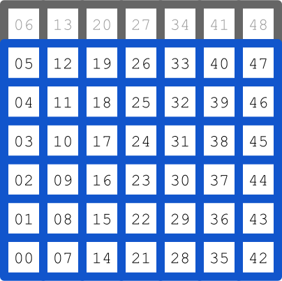
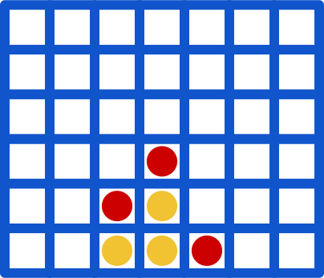
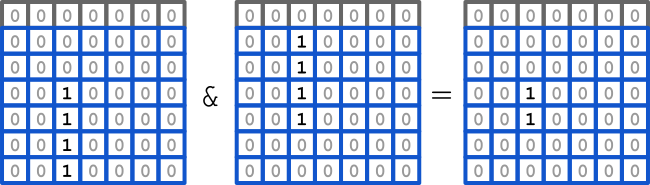
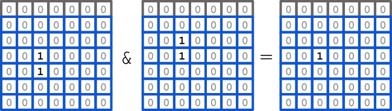

Title: Solving Connect Four
Category: Projects
Summary: Computing the optimal strategy for the game Connect Four

Here's the challenge I set myself:

> Solve Connect Four on a Macbook Air in no less than eight hours.

This is not exactly a big deal; Connect Four is known to be
a
[solved game](http://en.wikipedia.org/wiki/Connect_Four#Mathematical_solution). This
was proven independently by James Dow Allen and Victor Allis in the
late 80s and it turns out that the first player can always force a
win. Hell, I could have downloaded John
Tromp's [Fhourstones](http://homepages.cwi.nl/~tromp/c4/fhour.html)
from [Github](https://github.com/qu1j0t3/fhourstones) and solved it in
about 15 minutes, but did it by myself because it's interesting to do
something even if someone has done it before and I learned a lot along
the way.

The solving of games
--------------------

Very quick summary of game theory

Minimax
-------

The simplest approach to solving a game
the [Minimax](http://en.wikipedia.org/wiki/Minimax) algorithm.

    :::python
    def minimax(state):
        if state.is_terminal():
            return state.evaluate()
        else:
            value = VALUE_MAX if state.player == PLAYER_MIN else VALUE_MIN
            for child in state.children:
                child_value = minimax(child)
                if state.player == PLAYER_MAX:
                    value = max(child_value, value)
                else:
                    value = min(child_value, value)
            return value

The minimax algorithm will explore every node in the game tree.

Alpha beta
----------

A more efficient approach in practice is the [Alpha-beta]()
algorithm. It's similar to minimax except it takes parameters alpha and
beta, which are lower and upper bounds on the value of the game. A
very stupid implementation of alpha-beta would look like:

    ::python
    def alpha_beta(state, alpha, beta):
        value = minimax(state)
        if value < alpha:
            return alpha
        elif value > beta:
            return beta
        else:
            return value

The important thing here is that alpha-beta has fewer responsibilities
than minimax: it no longer always needs to return the value of a
state, if it can prove the value lies outside the bounds it can just
give up early. This is called a cutoff and it's very important in
making alpha-beta fast.

An implementation of alpha-beta that actually takes advantage of this is:

    ::python
    def alpha_beta(state, alpha, beta):
        if state.is_terminal():
            return state.evaluate()
        else:
            value = VALUE_MAX if state.player == PLAYER_MIN else VALUE_MIN
            for child in state.children:
                child_value = alpha_beta(child, alpha, beta)
                if state.player == PLAYER_MAX:
                    value = max(child_value, value)
                else:
                    value = min(child_value, value)

            return value

This algorithm is all you need to solve Connect Four, and when I say
'all you need' I am missing out a large number of practical details
that mean the difference between a runtime measured in hours and in
years.

But this article is all about the practical details, there are four
appendices full of details!

State representation: bitboards
-------------------------------

If we take a look at the alpha-beta algorithm above, it does two basic
operations - tests whether a state is terminal, and generates all the
children of a state - for every state it visits, so we better make
them fast.

One very efficient way to do (1) is to use a *bitboard* structure to
represent the pieces on the board. The idea is that we keep two 64-bit
numbers that record, for each position on the board, whether a piece
is present in that position for each player. Here's the layout on a
Connect Four board:

There are two slightly odd things here. Firstly, the ordering goes up
by rows first and then columns, which perhaps seems a little less
natural that column first. The second is those `XX` positions, which
correspond to indexes in the bitboard that always contain a zero,
called the zero barrier. We'll get into the reasons for both in a little bit.

Here's an example board encoding:

    p1 = 0000 0000 0000 0000 0000 0000 0000 0000 0000 0000 0110 0000 0100 0000 0000 0000
    b2 = 0000 0000 0000 0000 0000 0000 0000 0000 0001 0000 1000 0000 1000 0000 0000 0000

One advantage of a bitboard is it's very compact so allocation and
copying of states is going to be cheap. The other big advatage is that
testing whether a state is terminal can be implemented very
efficiently with a handful of bitwise operations. To see this first
think about a bitboard `b` and the expression `(b << 2) & b`

We have a bit set if there is a piece with another
pieces two positions to the left of it. Now let's do the trick again,
this time with a shift of one bit:

The final result will have a 1 in any position where there is a column
of four pieces. If we were to shift by the increments of the height of
the board instead of one, we can detect rows of four pieces and
shifting by `height+1` and `height-1` deals with diagonal lines of
four pieces.

We also need to check for a draw, which is just a bitwise OR of the
two bitboards and a comparison against a full bitboard.

The whole thing turns out looking like this:

    :::C
    uint64 line4(uint64 b) {
        uint64 x = 0;
        uint64 result = 0;
        // vertical lines
        x = ((b << 2) & b);
        result |= x & (x << 1);
        // horizontal lines
        x = (b << (2*(HEIGHT))) & b;
        result |= x & (x << (HEIGHT));
        // diagonal lines
        x = (b << (2*(HEIGHT+1))) & b;
        result |= x & (x << (HEIGHT+1));
        x = (b << (2*(HEIGHT+2))) & b;
        result |= x & (x << (HEIGHT+2));
        return result;
    }

    Value evaluate(uint64 p1, uint64 p2) {
        if((p1|p2) == draw) {
            return VALUE_DRAW;
        } else if(line4(p1) > 0) {
            return VALUE_MAX;
        } else if(line4(p2) > 0) {
            return VALUE_MIN;
        }
    }

Previously I said I'd explain why the bitboard is arranged in column
order and why it has an extra row of zeroes along the top. Exercise to
the reader!

So, in summary we can:

 * Store a game state in 16 bytes
 * Test for terminal states in ~50 ops

not bad!

State-Value Caching
-------------------

For some game states, you can reach them from many differen sequences
of moves.

In the later stages of the game, there can be a enormous number of
possible histories for a game state. This means we will be doing a lot
of redudant work in the search, calculating the value of the same
state over and over again.

I took a idea from chess engines and used a caching structure that
stores states and their values, which they call it a *transposition
table*, but I'm just going to call a cache.

The cache is implemented as a very simple hash table using
size, [open addressing](https://en.wikipedia.org/wiki/Open_addressing)
and [linear probing](https://en.wikipedia.org/wiki/Linear_probing) to
a fixed limit to resolve hash collisions. The nice thing about using a
hash table as a cache is that we don't have to care too much about
occasionally failing to retrieve something that was added, so we can
use a fixed size probe and just give up after that. This gives a
constant cost for lookup even when the hash table gets full, which is
otherwise a big problem for open-addressing in hash tables.

The hash map packs a key/value entry into a single 64-bit value by
some bit packing.

field | size (bits)
------|-----
key   | 48
alpha | 2
beta  | 2
depth | 6
best move | 4
**total** | **62**

The key is a highly compressed representation of the game state.

The depth of the game state is stored in order to easily do depth
replacement.

The best move is to calculate the optmial startegy (never got around
to it)

I
used [Zobrist hashing](https://en.wikipedia.org/wiki/Zobrist_hashing)
to generate the hashes. It's a fairly stupid hashing algorithm, but
has the virtues of being fast to calculate and fast to incrementally
update after each move.

The good news is that adding this cache is a tremendous performance
improvement, speeding up the execution time of the algorithm by at
least two orders of magnitude. The bad news is that we are making what
is essentially a random memory lookup for every single node we
explore. On my Macbook, an uncached memory lookup takes about 100ns,
which limits the search to a paltry **10 million nodes a
second**. This fact would depress me for some time.

Pruning
-------

Adding the cache was essential but it had imposed hard speed-limit on
the search. It was just not going to be fast enough to finish in eight
hours, instead it was going to take *weeks*. The only option now was
to do less work.

For example, starting from a empty Connect Four board, let's assume
player 1 puts their first piece in the central column. Solving from
this state you can show that player 1 can force a win from this state,
so you can terminate your search without evaluating any other states
because you can't get better than winning the game. If you were
instead to explore all first move positions from left to right, you
would do a lot of work evaluating the first three columns before you
found the winning move.

The principle here is that some traversal orders are better than
others and the best orders are the ones where the first move explored
guarantees a win for the relevant player. The catch is if
you knew the moves which would result in a win ahead of time, you
would have solved the whole problem already. The best we can do is
work out cheap heuristic functions which tend to identify moves that
are likely to result in cutoffs and explore them first.

The first thing we can do is to determine if any child is a winning
state before we start doing the expensive evaluation step on each
child.

    ::python
    for child in state.children:
        if child.evaluate() == WIN_P1 and state.player() == P1:
           return WIN_P1
        elif child.evaluate() == WIN_P2 and state.player() == P2:
           return WIN_P2

A second idea - taking inspriation from the example above - is to
explore the central columns first before trying the columns further
away from the centre. This is based on the intuition that these moves
are more valuable because there are more ways to connect a piece in
the centre in a line of four than there are for a piece in a corner.

A well-known technique to get a better move ordering in chess programming
is the [killer heuristic](http://en.wikipedia.org/wiki/Killer_heuristic). This is a
very simple heuristic where you keep track of the last move that
caused a cutoff at the depth you are currently and pick that as your
first move to explore. The idea is that the tree has some kind of
locality where a good move for one state will be a good move for its
sibling states since they are likely to be very similar.

Another move ordering technique is the [history heuristic] where you
keep a record of how many times a move in each column has caused a
cutoff at any depth.

One way of reducing the search space, similar to the state
cache mentioned before is to exploit symmetries in the game state. If
you were to mirror the board along the central column you would have a
state that would have the exact same value. We can mirror a bitboard
fairly quickly and make a second check in our cache for the mirrored
board, effectively reducing the state space by a factor of two.

Another way of obtaining a good move ordering is iterative deepening.

Ordering                | Speedup
------------------------|---------
Killer heuristic        |  10x
LR symmetry             |  20x
Iterative deepening     |   5x
Central bias            |   2x
Evaluation to depth 1   | 0.5x

Summary:

 * First sweep on children to test for winning moves
 * Static move ordering, biased to the central column
 * Killer heuristic reordering to promote the killer move

Conclusion
==========

Put it all together and what do you have? Something that can solve
Connect Four in about two hours!

 * This was a long article
 * The details of the search make a 1000x difference
 * Pruning is king

---

This article got very long, so I relegated some of the interesting but
non-essential stuff to the following appendices.

Appendix A: Miscellaneous performance stuff
-------------------------------------------

The tree things above were the major factors in getting the runtime
down, however there were a few other things that helped to a smaller
degree:

  * Playing around with what to cache, max depth
  * Prefetching before cache access
    worthless
  * Memory pooling for the states
    Surprising
  * Using a sorting network for the move reordering
    You could probably do it better but sorting approach is very
    flexible. Ended up using very little time.
  * -O3 -ftree-vectorise
    Got us about 10%
  * Better reporting of the state of evaluation
    Tracking things like cache utilisation, average index of cutoffs,
    etc helped a lot
  * Profilers
    Valgrind, instruments

End of the day 60% of the time is in get/put, 30% in children and
evaluate and the rest went somewhere else.

Appendix B: Run-time projections
--------------------------------

Appendix C: Parallelising alpha-beta
------------------------------------

I also read a lot about parallelisation from the history of chess
computers, but the short answer is that it's a waste of time. The
reasons why it's a waster of time are kind of interesting though.

Appendix D: Improving alpha-beta
--------------------------------

If you look at things written about chess programming, the most
promising improvements to alpha-beta are either parallelisation of
regular alpha-beta or an algorithm called MTD(f) which is supposed to
be more efficient.

Parallelisation of alpha-beta is not a particularly straightforward
thing. The introduction of a pruning step after exploring each child
state makes the algorithm explicitly serial, that's why it's fast in
the first place. In order to be able to parallelise alpha-beta you
have to be willing to give up on (at least some of) that pruning.

For me, MTD(f) was not an algorithm that made a lot of sense to me,
even after reading several detailed explanations. However, as
sometimes happens, the original paper on the algorithm gives by far
the best explanation of MTD(f). My brief summary is this: alpha-beta
is fastest when the space between alpha and beta is small (called the
search window). A small search window means more cutoffs and a smaller
time to complete but is also likely to be unhelpful if the true value
doesn't lie between alpha and beta.

End of the day 60% of the time is in get/put, 30% in children and
evaluate and the rest went somewhere else.
